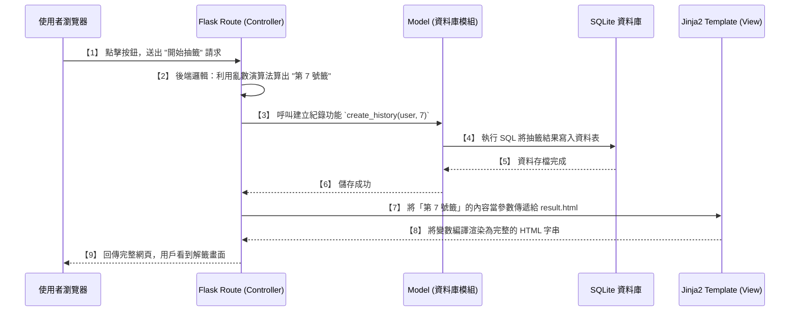

# 系統架構文件 - 線上算命系統

## 1. 技術架構說明

本專案會採用傳統的 Server-Side Rendering（伺服器端渲染）架構，也就是不需要把前端與後端完全分離，由後端框架直接將資料填入 HTML 中，一併呈獻給使用者。

- **選用技術與原因**：
  - **後端框架：Python + Flask**
    - 原因：Flask 是一個輕量、靈活的框架，比起 Django 沒有那麼多繁瑣的預設規定，非常適合拿來快速開發初期的 MVP 與小型專案。
  - **模板引擎：Jinja2**
    - 原因：Flask 內建，能夠在 HTML 中嵌入類似 Python 的語言邏輯（如 `if` / `for` 控制），可以很方便地將後端的運算結果（例如使用者的籤詩）帶入網頁中。
  - **資料庫：SQLite**
    - 原因：免額外安裝、免設定伺服器，將所有資料都存成一個單純的 `.db` 檔案即能運作。足以應付初期使用者註冊與算命紀錄。

- **Flask MVC 模式說明**：
  這個專案我們會借鑑 MVC（Model-View-Controller）模式來規劃目錄結構：
  - **M（Model - 資料模型）**：負責與 SQLite 存取互動，比如定義「使用者」存了什麼樣的註冊資訊、一筆「算命紀錄」要包含什麼欄位（籤號、時間等）。
  - **V（View - 視圖）**：這部分由 Jinja2 模板擔任。負責決定畫面長成什麼樣子、按鈕在哪裡。
  - **C（Controller - 控制器）**：由 Flask 的路由（Routes）擔任。它是大腦，當使用者點下「開始抽籤」時，路由負責先去思考（運算隨機結果），接著交代 Model 去儲存結果，最後把資料塞進 View（模板）呈現給使用者。

## 2. 專案資料夾結構

以下是本專案的目錄結構：

```text
online-fortune-system/
│
├── app/                  # 應用程式的主目錄
│   ├── __init__.py       # 初始化應用與綁定設定、資料庫
│   ├── models/           # 負責 Model，資料庫表格定義
│   │   ├── __init__.py
│   │   ├── user.py       # 定義會員模型
│   │   ├── fortune.py    # 定義算命歷程與籤詩內容模型
│   │   └── donation.py   # 定義香油錢紀錄模型
│   ├── routes/           # 負責 Controller，API 與網頁路由模組
│   │   ├── __init__.py
│   │   ├── auth.py       # 註冊登入相關邏輯
│   │   ├── main.py       # 首頁、抽籤核心邏輯
│   │   └── donation.py   # 香油錢表單與紀錄邏輯
│   ├── templates/        # 負責 View，Jinja2 模板
│   │   ├── base.html     # 共用框架（包含首部、尾部）
│   │   ├── index.html    # 首頁、抽籤介面
│   │   ├── result.html   # 抽籤與算命結果展示頁
│   │   ├── login.html    # 註冊 / 登入頁
│   │   └── history.html  # 使用者歷史抽籤紀錄頁
│   └── static/           # 靜態資源檔案 (瀏覽器直接讀取)
│       ├── css/
│       │   └── style.css # 樣式檔
│       ├── js/
│       │   └── anim.js   # 前端輕量互動(如籤筒動畫)
│       └── images/       # 圖片素材(如籤筒、神像)
│
├── instance/             # 不受版控追蹤，存放密碼鑰匙或實體資料庫
│   └── database.db       # SQLite 實體資料庫檔案
│
├── docs/                 # 文件放置區
│   ├── PRD.md            # 需求文件
│   └── ARCHITECTURE.md   # 架構文件 (本文件)
│
├── requirements.txt      # Python 相依套件清單
├── .gitignore            # 忽略不受 git 紀錄的檔案
└── app.py                # 整個應用程式的啟動入口 (entrypoint)
```

## 3. 元件關係圖

以下利用循序圖（Sequence Diagram）來展現這三種元件當遇到「抽籤」這個動作時，它們是怎麼互相合作的。



## 4. 關鍵設計決策

以下列出這個專案幾個比較重要的設計選擇與理由：

1. **依功能拆分檔案 (運用 Flask Blueprints)**
   - **決定**：雖然可以用一個大的 `app.py` 把所有路由寫完，但我們採用了把 `routes/` 切分成 `auth.py`, `main.py`, `donation.py`。
   - **原因**：為了長期好維護與減少找扣的時間。註冊登入、核心算命、捐獻是三件獨立的事情，分開寫可以讓職責更清楚。
2. **所有計算與決定權保留在後端**
   - **決定**：核心的抽籤演算法（該抽中什麼）、金額的防竄改，全部在 Python (`routes/`) 中完成。
   - **原因**：資安考量。如果我們把抽籤結果交給前端 JavaScript 來決定，可能會被進階懂得修改網頁原始碼的用戶亂改，失去算命的隨機與權威性。前端的 JS 將單純用來做「搖動籤筒動畫」。
3. **Session-based 驗證機制**
   - **決定**：使用 Flask 內建的 Session 功能來記憶誰已經登入過了，而不用實作現代流行的 JWT Token 驗證。
   - **原因**：此專案並非前端與後端分離架構，傳統的 Session (Cookie 基礎) 最適合這個情境，免去許多多餘且複雜的身分驗證安全設定，讓開發變得簡單明快。
4. **選用輕量級的 CSS 組織方式**
   - **決定**：由於專案不複雜，前端將以一個主要的 `style.css` 搭配基礎且直觀的標籤為設定，亦可以根據需求匯入成熟框架，不需要過度複雜的建置工具 (如 Webpack 或 Vite)。
