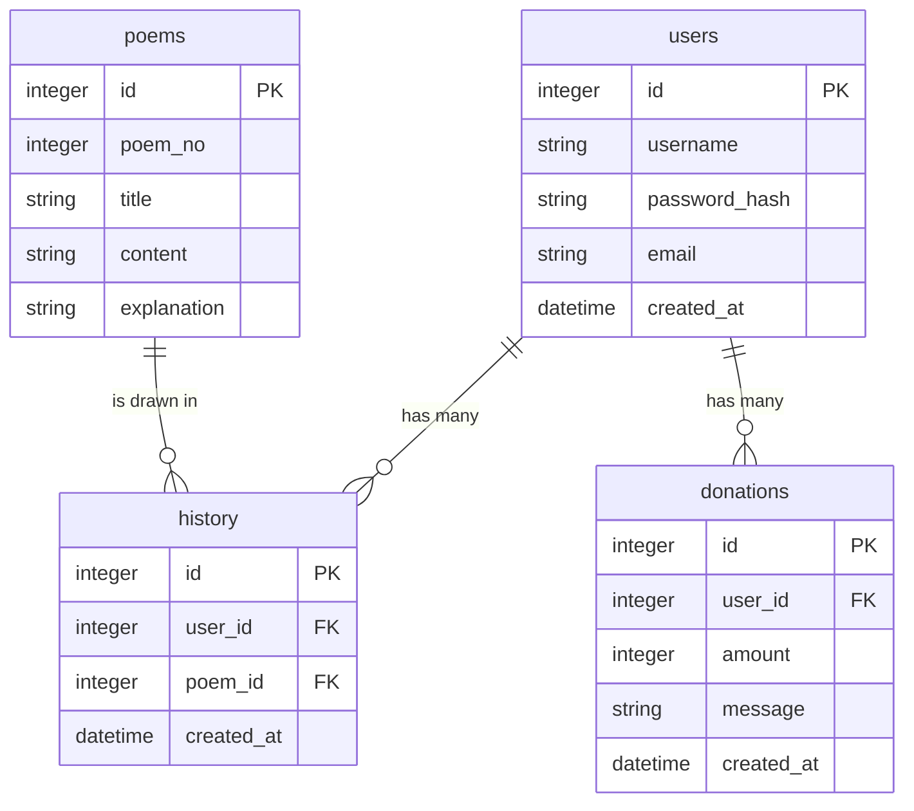

# 資料庫設計文件 - 線上算命系統

## ER 圖（實體關係圖）

## 資料表詳細說明

### 1. `users` (會員資料表)
儲存使用者的基本資料與登入資訊。

| 欄位名稱 | 型別 | 必填 | 說明 |
| --- | --- | --- | --- |
| `id` | INTEGER | 是 | Primary Key |
| `username` | TEXT | 是 | 遊戲/顯示的名稱或登入帳號 (Unique) |
| `password_hash` | TEXT | 是 | 加密後的密碼 |
| `email` | TEXT | 否 | 聯絡信箱 |
| `created_at` | DATETIME | 是 | 註冊時間 |

### 2. `poems` (籤詩資料表)
儲存系統中所有的籤詩內容與解要。

| 欄位名稱 | 型別 | 必填 | 說明 |
| --- | --- | --- | --- |
| `id` | INTEGER | 是 | Primary Key |
| `poem_no` | INTEGER | 是 | 籤詩號碼 (例如 8號籤) |
| `title` | TEXT | 是 | 籤首標題 (例如 "中吉") |
| `content` | TEXT | 是 | 籤詩內容 |
| `explanation` | TEXT | 是 | 詳解/解籤內容 |

### 3. `history` (算命紀錄表)
紀錄使用者何時抽到了哪支籤。

| 欄位名稱 | 型別 | 必填 | 說明 |
| --- | --- | --- | --- |
| `id` | INTEGER | 是 | Primary Key |
| `user_id` | INTEGER | 是 | FK 對應至 `users.id` |
| `poem_id` | INTEGER | 是 | FK 對應至 `poems.id` |
| `created_at` | DATETIME | 是 | 抽籤並儲存紀錄的時間 |

### 4. `donations` (香油錢捐款紀錄表)
儲存捐贈香油錢的紀錄。

| 欄位名稱 | 型別 | 必填 | 說明 |
| --- | --- | --- | --- |
| `id` | INTEGER | 是 | Primary Key |
| `user_id` | INTEGER | 否 | FK 對應至 `users.id` (允許非會員捐款) |
| `amount` | INTEGER | 是 | 捐款金額 |
| `message` | TEXT | 否 | 祈福或還願留言 |
| `created_at` | DATETIME | 是 | 捐獻時間 |
