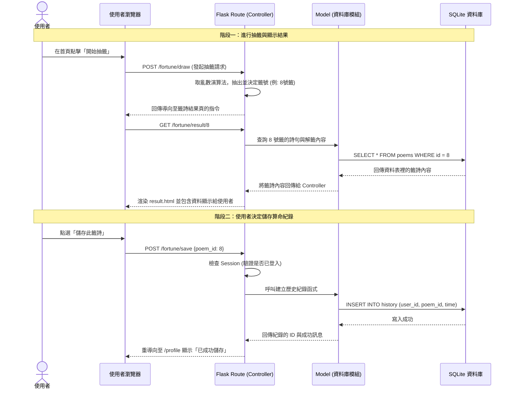

# 系統流程圖 - 線上算命系統

本文件根據 PRD 與系統架構，定義使用者在使用此系統時的操作路徑，以及對應的系統前後端溝通流程。

## 1. 使用者流程圖 (User Flow)

此圖展示了使用者進入系統後，可能發生的重點操作與頁面跳轉流程。

```mermaid
flowchart LR
    A([使用者進入網站]) --> B[首頁 - 歡迎與抽籤入口]
    
    B --> C{是否已登入？}
    C -->|否| D[點擊右上角登入/註冊]
    C -->|是| E[點擊開始線上算命/抽籤]
    
    D --> F[登入/註冊頁面]
    F -->|填寫帳密| G[驗證登入]
    G -->|成功| B
    G -->|失敗| F
    
    E --> H[進入搖籤筒動畫]
    H --> I[顯示抽籤結果頁面 (籤詩內容)]
    
    I --> J{後續動作選擇}
    J -->|儲存紀錄| K[儲存結果至個人紀錄]
    J -->|社群分享| L[觸發社群分享 (FB/IG/LINE)]
    J -->|捐香油錢| M[進入捐獻還願頁面]
    J -->|重新抽籤| E
    
    K --> N[個人紀錄與成就頁面]
    M --> O[填寫金額與付款資訊]
    O --> P[完成捐款感謝頁面]
```

## 2. 系統序列圖 (Sequence Diagram)

此處展示核心功能：「**從求籤、顯示結果，到使用者登入並儲存結果**」的詳細內部系統通訊流程。



## 3. 功能清單對照表

本表預先規劃了系統所需的路由，列出各功能對應的 URL 路徑與使用的 HTTP 請求方法。

| 模組功能 | 操作行為 | URL 路徑 | HTTP 方法 | 說明 |
| :--- | :--- | :--- | :--- | :--- |
| **首頁** | 訪問網站首頁 | `/` | GET | 顯示歡迎畫面、介紹與準備抽籤入口 |
| **會員管理** | 查看登入/註冊表單 | `/auth/login` | GET | 顯示讓會員填寫帳號密碼的頁面 |
| | 送出註冊資料 | `/auth/register` | POST | 接收表單並將新會員存入資料庫 |
| | 送出登入資料 | `/auth/login` | POST | 驗證帳密正確性並寫入 Session |
| | 會員登出 | `/auth/logout` | GET/POST | 清除現有登入的 Session 狀態 |
| | 訪問個人紀錄頁面 | `/profile` | GET | 從資料庫查詢該會員儲存的所有過往籤詩 |
| **抽籤算命** | 觸發隨機抽籤 | `/fortune/draw` | POST | 系統隨機決定結果 ID，並進行頁面重導向 |
| | 檢視特定籤詩 | `/fortune/result/<id>` | GET | 以版型渲染出相對應的籤首、籤詩與詳解 |
| | 儲存算命成果 | `/fortune/save` | POST | 綁定當前登入會員與特定籤詩，寫入歷史紀錄 |
| **回饋與分享** | 觸發分享機制 | `/fortune/share/<id>` | GET/API | 產生用於社群軟體的縮圖與預覽連結 |
| | 訪問香油錢表單 | `/donation` | GET | 顯示捐款說明與金額填寫選項 |
| | 送出香油錢 | `/donation/submit` | POST | 紀錄使用者的捐款資訊並導向完成頁面 |
